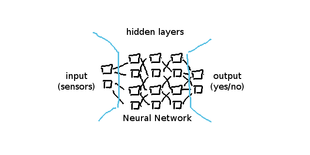
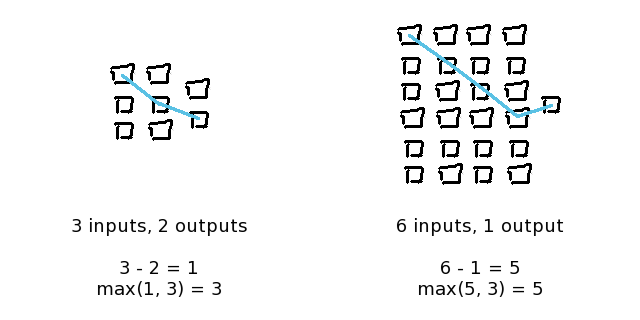

## Feed-Forward Network

In order to understand how neural networks and how
backpropagation works, we need to implement a simple
neural network first.

If you remember, neural networks basically look like this:



We also know from this chapter that neurons themselves
always have a `value` and `weights` representing their
connections to the neurons of the previous layer. When
talking about previous and next, previous means more to the
left in our graphic.

For example, `layers[1]` in our above network has `4 neurons`
with `2 weights` each - because `layers[0]` is the input
layer and has `2 neurons`.

```javascript
// A neuron inside a neural network where hidden layers
// (and input layer) have each 3 neurons

let neuron = {
	value:   _random(),        // value for computation
	weights: [ 0.5, 0.5, 0.5 ] // weights for each connection
};
```


**Implementation**

Now we are going to implement above graphic into code. Don't
be afraid, a feed-forward neural network is very easy to
implement; especially in ECMAscript.

We are going to implement a `Brain` constructor, and we are
building it in a generic sense so that we can reuse it later
for our own games and even in our more advanced NEAT
projects.


A neural network consists of three different types of layers
in our `Brain`: 1 input layer, multiple hidden layers and an
output layer.

```javascript
const Brain = function() {

	// TODO: Proper initialization
	this.layers = [];

	// input layer
	// this.layers[0];

	// output layer
	// this.layers[this.layers.length - 1];

	// each layer has multiple neurons
	// this.layers[l][n] is a Neuron

};
```


**Neural Network Size**

Many people constantly do research on how big a neural
network should be until it can learn and understand a given
dataset.

As an ANN guy I have something like a "rule of thumb" for
the size, arguing with the situation that every input neuron
must be able to reach an output neuron diagonally - so that
a worst-case XOR situation from the "most top input" to the
"most bottom output" (and vice-versa) can be computed
successfully.

However, if you have time-sensitive data this might not be
what you want. I'm going into time-sensitive data problems
later in this article series as it's not so easy to
understand right now.

The important part to remember is that the minimum situation
of `1 input` and `1 output` the network still needs at least
`3 layers` for successful computation, having `1 input
layer`, `1 hidden layer` and `1 output layer`.




Note that in the right example the diagonal overlapping over
the horizontal center is important, as this will allow
decisions made from the most top input to be influenced by
decisions made from the most bottom input.

Other people have a different "strong opinion" on that, but
ignoring boring image classifications for now this pretty
much always works when it's not used for time-senstive data.

When we want to describe our network sizes in code, we now
need four different sizes to create a neural network:

- `input_size` is the input (sensor) array's length
- `output_size` is the output (control) array's length
- `layers_size` is the amount of layers necessary
- `hidden_size` is the amount of neurons per hidden layer


In code the previously mentioned "rule of thumb"
implementation looks like this:

```javascript
let input_size  = 2;
let output_size = 2;
let layers_size = 3;
let hidden_size = 1;

if (input_size > output_size) {
	hidden_size = input_size;
	layers_size = Math.max(input_size - output_size, 3);
} else {
	hidden_size = output_size;
	layers_size = Math.max(output_size - input_size, 3);
}
```

