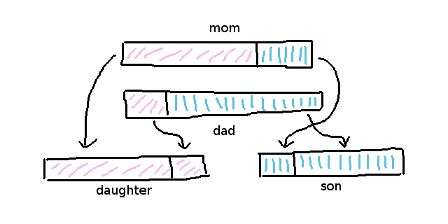

## Genetic Programming

Genetic programming is the idea to represent data structures
similar to how biology represents knowledge in the form of
DNA.

The idea is quite old by modern computer science standards,
but it is nevertheless a powerful tool to advance systems
where the learning model is incomplete.

The huge advantage genetic pogramming has is that when
combined with an evolutionary algorithm it can help advance
into the direction of the correct values very rapidly.

In order for genetic programming to work, it always has to
have a reward or evaluation algorithm that allows to measure
the progress relatively and not absolutely.

That means that you have to be able to measure for example
that the neural network has advanced around 20% better in
performance than before - yet we still don't know the maximum
performance it can achieve in future.

Often those evaluation algorithms are part of an
evolutionary cycle that also keeps track of all different
variants of the parameters that were tried out already, but
didn't succeed in progress.

When talking about a gene or genome, it is just a simple array
of values like this:

```javascript
let mum_genome = [ 1, 1, 0, 0, 1, 0 ];
let dad_genome = [ 0, 0, 1, 1, 0, 1 ];
```

The progress measurement algorithm often relies on
differences between a known optimum state and a given
temporary state that is evaluated.

In a simple bruteforce scenario, a progress measurement
algorithm could look like this, giving each genome a better
score based on how strongly it differs from an optimum
genome:

```javascript
const _OPTIMUM_GENOME = [ 1, 1, 0, 1 ];

const _measure_progress = function(genome) {

	let score  = 0;
	let length = _OPTIMUM_GENOME.length;

	for (let o = 0; o < length; o++) {

		if (genome[o] === _OPTIMUM_GENOME[o]) {
			score++;
		}

	}

	// NaN stuff in ECMAscript
	if (score > 0) {
		return score / length;
	}

	return 0;

};
```

The values can represent pretty much anything when it comes
to the data structure and data types itself.

However, the idea of a gene is to represent the complete state
of an agent in a multi-agent simulation - so that we are able
to compare it later and to reproduce the state of parameters
1:1 in future.

So, in a sense, a genome completely represents the states of
a class instance or composite instance in programming
terms and is a 1:1 short representation of our internal API.

In more complex systems that we will dig into later, genes
also try to represent similar to biology how dominant and
active they are, so genes are part of genomes and can be
activated, deactivated or even reinforced based on their
breeding and ancestor hierarchy.


**ZW Agent and ZZ Agent**

The so-called crossover algorithm is an algorithm that
allows to split, combine and evaluate healthy DNA
structures.

The DNA split typically is randomized, so that every part of
the gene (or genome) gets a chance to get dominant by
randomization.

For example, when the DNA split is `0.3` that means that the
ZW gene (mother) is split at `30%` of its length while the ZZ
gene (father) is split at `70%`.



A typical evolutionary algorithm always produces two
different babies, one that has more dominant characteristics
of the mother (daughter) and one that has the dominant
characteristics of the father (son):

```javascript
let genome_mother = [ 1, 1, 0, 0, 1, 0 ];
let genome_father = [ 0, 0, 1, 1, 0, 1 ];


// crossover algorithm
// XXX: assumes that both genomes have same length

let dna_split       = (Math.random() * genome_mother.length) | 0;
let genome_daughter = new Array(genome_mother.length);
let genome_son      = new Array(genome_mother.length);

for (let d = 0; d < genome_mother.length; d++) {

	if (d > dna_split) {
		genome_son[d]      = genome_mother[d];
		genome_daughter[d] = genome_father[d];
	} else {
		genome_son[d]      = genome_father[d];
		genome_daughter[d] = genome_mother[d];
	}

}

console.log(genome_daughter);
console.log(genome_son);
```

